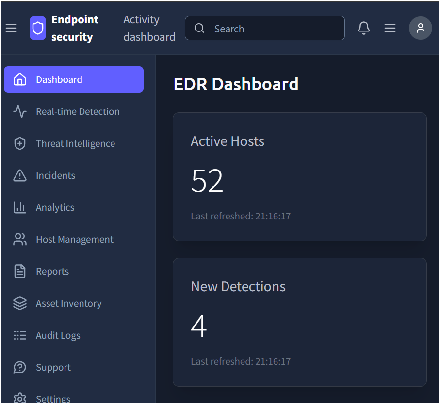
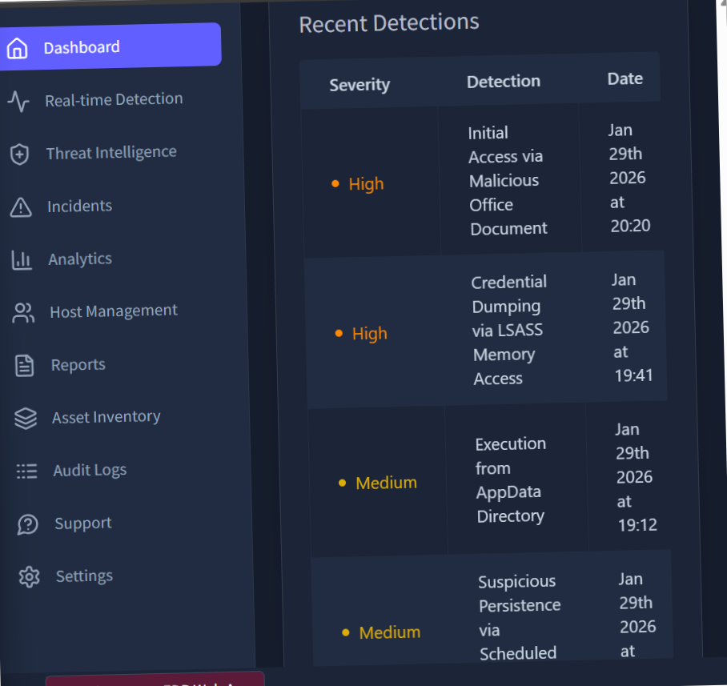
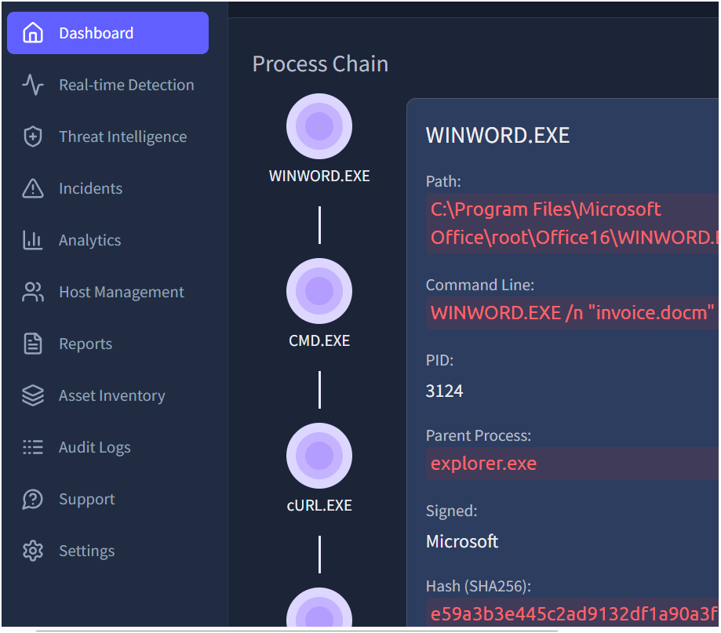
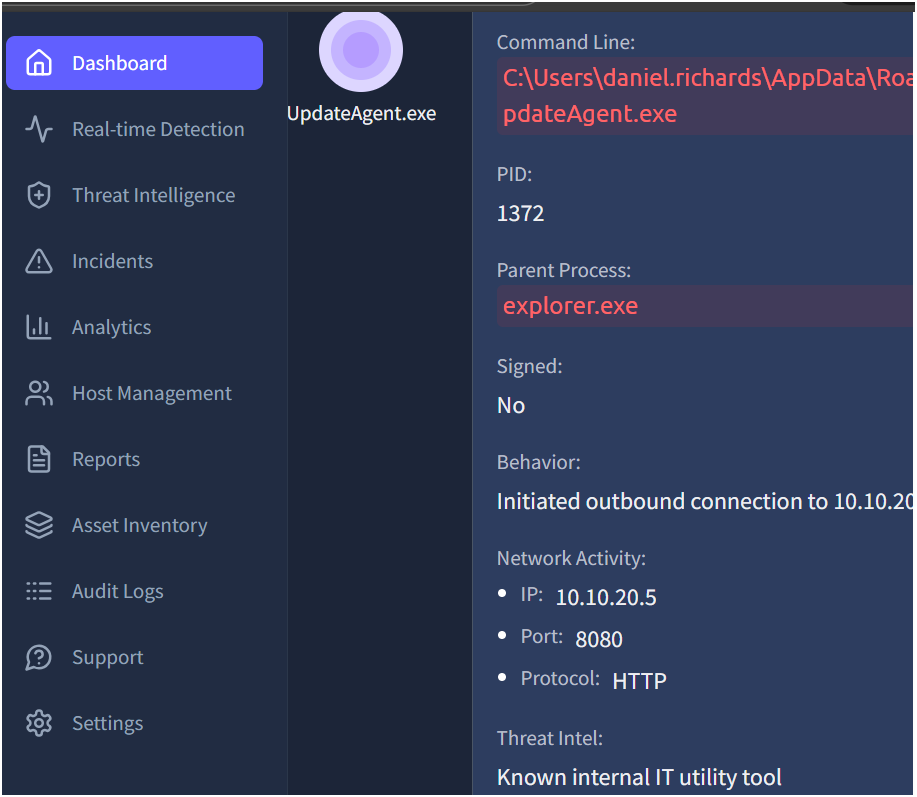

# Introduction to EDR — TryHackMe

## Objective
To understand how Endpoint Detection and Response (EDR) solutions collect telemetry, detect malicious behaviour, and assist SOC analysts in investigating endpoint-based attacks.

## Key Concepts Learned
- What an EDR agent is and how it collects endpoint telemetry  
- How EDR detects:
  - Malicious process execution
  - Credential dumping
  - Persistence mechanisms
  - Data exfiltration attempts  
- How alerts are prioritised using severity levels  
- How analysts correlate process, file, and network activity  

## Environment Overview

**Platform:** EDR Web Application  

**Endpoints Investigated:**
- WIN-ENG-LAPTOP03  
- DESKTOP-DEV01  

**Focus:** Endpoint behaviour rather than signature-based detection.

## Alerts Observed

### High Severity
**Initial Access via Malicious Office Document**  
Indicates phishing or malicious document execution.

**Credential Dumping via LSASS Memory Access**  
Suggests an attempt to extract credentials from memory — a critical attack stage.

###  Medium Severity
**Execution from AppData Directory**  
Malware often runs from user writable locations to evade detection.

**Suspicious Persistence via Scheduled Task**  
Indicates the attacker attempted to maintain access after reboot.

## Investigation Highlights

- A suspicious executable (`syncsvc.exe`) was observed running from a temporary user directory, which is uncommon for legitimate Windows services.
- Network activity associated with this process suggested a possible **data exfiltration attempt**.

- Another executable (`UpdateAgent.exe`) was analysed using **Threat Intelligence** and classified as malicious.

## EDR Components in Action

**Agent / Sensor**  
Installed on endpoints to collect telemetry such as process execution, file changes, registry activity, and network connections.

**Detection Engine**  
Analyses behavioural data and raises alerts based on suspicious activity.

**Threat Intelligence**  
Enriches investigations by labelling known malicious files and behaviours.

##  Analyst Takeaways
- Legitimate Windows processes can be abused or mimicked by attackers.
- Execution location matters **Temp and AppData directories are red flags**.
- Alerts must be correlated rather than investigated in isolation.
- EDR provides visibility across the **entire attack lifecycle**, not just initial access.

## Skills Practiced
- SOC alert triage  
- Endpoint investigation  
- Behaviour-based detection analysis  
- Understanding attacker techniques (MITRE ATT&CK aligned)

## Conclusion
This lab demonstrated how EDR tools support SOC analysts by providing deep visibility into endpoint activity. By analysing alerts, telemetry, and threat intelligence, analysts can effectively identify, investigate, and respond to real-world attacks.

> Screenshots are included for educational purposes only. No flags or answers are disclosed.

